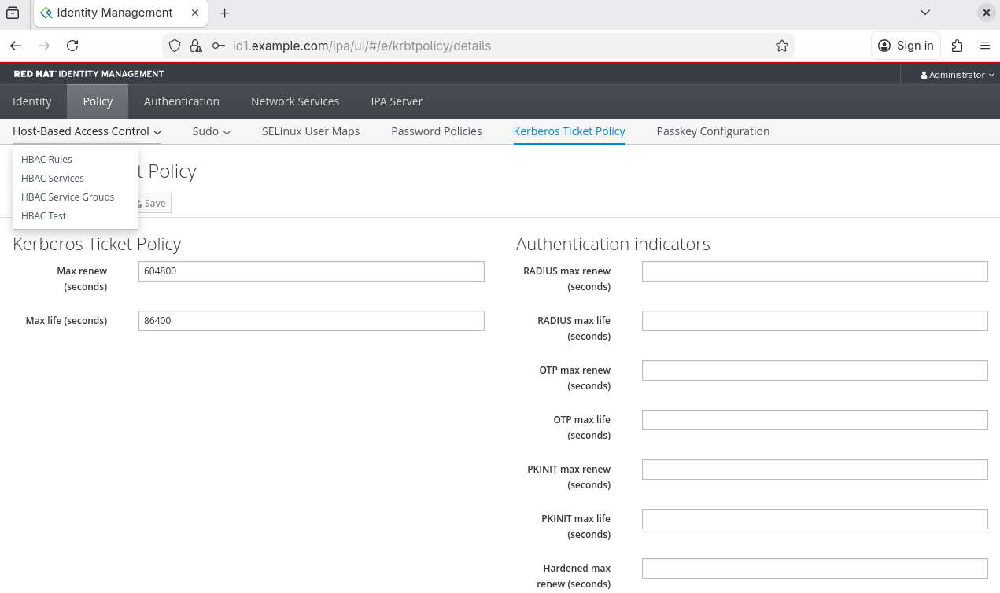

# Building Linux Servers: DHCP, DNS and DS
Config files for Building Linux Servers (DHCP, DNS, DS) Course.

Note: These configuration files are designed for learning and testing purposes, and not for use in a production environment.

For official documentation on installing kea packages, refer to: https://kb.isc.org/docs/isc-kea-packages

# 1. Building DHCP Server

I have already created a Debian-based VM with FQDN, `dhcp1.example.com` with static IP: `10.0.2.4/32` to act as the DHCP Server for this network, ServersNAT.

## Setup ISC-Kea reposiory:
First setup Kea3.0 repository in debain as:
```
curl -1sLf \
  'https://dl.cloudsmith.io/public/isc/kea-3-0/setup.deb.sh' \
  | sudo -E bash

```
 Then install isc-kea as:
 ```
 apt install isc-kea
 ```

## Setup BuildingLinuxServer Repository:
Now, make sure you are logged in as root to a Debian system.
Access the  ~ directory and clone this repository there.

```
su -
cd ~ && git clone https://github.com/biplavpoudel/BuildingLinuxServer.git
cd BuildingLinuxSever
```

## Configure Kea-DHCP4-Server
For kea-dhcp4.conf file, install the kea-dhcp4 server and then, copy the individual files to their respective locations. Backup the original configurations file first.

```
apt install isc-kea-dhcp4-server
systemctl disable isc-kea-dhcp4-server.service

mv /etc/kea/kea-dhcp4.conf /etc/kea/dhcp4.conf.bak
cp /kea/kea-dhcp4.conf /etc/kea/
```

Test the configuration now. Optionally, use journalctl for more in-depth system logs.
```
kea-dhcp4 -t /etc/kea/kea-dhcp4.conf

journalctl -u isc-kea-dhcp4-server.service
```

Fix any errors and start up the service:
```
systemctl enable --now isc-kea-dhcp4-server.service
systemctl status isc-kea-dhcp4-server.service
```
If green color is shown, you are good to go!

Ensure the server is listening on port 67 for incoming DHCP requests by checking all the open ports:
```
ss -tulnw
```

## Update KVM's NAT Network Connection
I am using a manually created NAT network called ServersNAT, in my KVM host, for all the VMs.
```
sudo virsh net-edit ServersNAT
```
So locate and remove the <dhcp> section inside <ip> element. Then reactivate the network as:
```
sudo virsh net-destroy ServersNAT
sudo virsh net-start ServersNAT
```

## Renew lease on client VMs
Make sure you have isc-dhcp-client package installed.
```
sudo apt install isc-dhcp-client
```
Then renew the lease using:
```
sudo dhclient -r
sudo dhclient
```

## Use Postgressql as Lease Database
Ensure you build and compile the binary package with switch ```-D postgresql=enabled``` .
For more info, visit: https://kea.readthedocs.io/en/kea-3.0.2/arm/install.html#building-with-postgresql-support

```
git clone https://gitlab.isc.org/isc-projects/kea.git
cd kea
git checkout 3.0.2
meson setup build -D postgres=enabled
meson compile -C build
meson install -C build
```

After setup, update /etc/kea/kea-dhcp4.conf as:
```
"database": {
    "type": "postgresql",
    "host": "192.168.254.26",
    "name": "kea_db",
    "user": "kea_user",
    "password": "****"
}
```

In this example, I have set up PostgreSQL database in my KVM host so I used my host IP `192.168.254.26`.

Visit this link to configure the database: https://kea.readthedocs.io/en/kea-3.0.2/arm/admin.html#pgsql-database-create

In the host, modify `/var/lib/data/pgsql/pg_hba.conf` to include:
```c
host  kea_db  kea_user  10.0.2.4/32 md5
```

Add a firewall rule to allow incoming connection to 5432 port as:
```
sudo firewall-cmd --zone=libvirt --add-port=5432/tcp --permanent
```

Then test from dhcp1 as: `psql -h 192.168.254.26 -U kea_user -d kea_db`
Then intialize database as: 
```
kea-admin db-init pgsql \
  -h '192.168.254.26' \
  -n 'kea_db' \
  -u 'kea_user' \
  -p '****'
```

Took me a long time to figure it out!!!

## Benchmarking DHCPv4
Install isc-kea repository in your client VM and then install perfdhcp package:
```
sudo apt install isc-kea-perfdhcp
```
Ensure the isc-kea version matches between client and server.

Now to benchmark, run `perfdhcp` against the kea-dhcp4 server `10.0.2.4`:
```
perfdhcp 10.0.2.4
```

To specify number of 4-way exchanges (DORA) for second, use:
```
perfdhcp -r <number_of_exchanges> 10.0.2.4
```

## Run Kea-DHCP4 Server as Container

Create a network, say network1, with:
```
podman network create network1
podman network inspect network1
```

Then we will pull the latest ubuntu image, set its network and MAC address and run it as a priviledged container:
```
podman create -ti --privileged --net=network1 --mac-address 1a:1b:1c:1d:1e:1f  ubuntu
```

You can rename container, in my case it was peaceful_sutherland; then check it and run as:
```
podman rename peaceful_sutherland kea-1
podman container ls -a
podman container start kea-1
```

Install packages externally using:
```
podman exec kea-1 apt install curl iputils-ping git net-tools vim -y
```

To enter into the container's `/bin/bash`, use:
```
podman exec -it kea-1 /bin/bash
```
 
Since systemctl is not running inside the kea-1 container, after installing `isc-kea` packages and configuring `kea-dhcp4.conf` file, you can use:
```
podman exec kea-1 /etc/init.d/isc-kea-dhcp4-server status
podman exec kea-1 /etc/init.d/isc-kea-dhcp4-server start
```

Rest of the steps are pretty similar as running kea-dhcp4-server in VM.


# 2. Building DNS Server

I have created a Debian-based VM with FQDN, `ns1.example.com` with static IP: `10.0.2.5/32` to act as the DNS Server for this network, ServersNAT.

## Installation of BIND Packages
Install the necessary bind9 (Berkeley Internet Name Domain) packages:
```
apt install -y bind9 bind9-doc dnsutils
systemctl status bind9.service
```

Installation and configuring process is different for rpm-based distros like RedHat, CentOS and Fedora.
```
dnf install bind bind-utils
systemctl status named
systemctl start named

vim /etc/named.conf     # in debian, it is in /etc/bind/named.conf
```

### Testing BIND9 Daemon
To check if bind9 daemon is repsonding or not, we can query NS records for root domain(.) using loopback address as DNS Server:
```
dig @127.0.0.1 . NS
```

## Configuration of BIND9 daemon
Now, in `/etc/resolv.conf` change the nameserver to point to this VM's IP:
```c
nameserver 10.0.2.5
```
Ensure the `/etc/kea/kea-dhcp4.conf` in dhcp1 (10.0.2.4) correctly points to 10.0.2.5 for DNS in `option-data/domain-name-servers` key.

Since we want to mostly work in IPv4, we will direct named daemon to listen on IPv4 sockets only. 
Modern Debian system uses `/etc/default/named` for service runtime options, so open and modify the file:
```
sudo nano /etc/default/named
```
Locate `OPTIONS` line and append `-4`.
```ini
OPTIONS="-u bind -4"
```

Then, we run:
```
systemctl restart named
```
To confirm BIND no longer listens on IPv6 sockets:
```
ss -tulpn | grep named
```
It should be noted that `named.service` is an alias for `bind9.service`.

## Configuration of Forward and Reverse Lookup Zones

After copying `named.conf.*` into `/etc/bind`, create a new directory `/etc/bind/zones` and copy db.* files there.
```
cp BuildingLinuxServer/bind-files/named.conf.* /etc/bind/
cd /etc/bind
mkdir zones && cd zones
cp ~/BuildingLinuxServer/bind-files/db.example.com .
cp ~/BuildingLinuxServer/bind-files/db.2.0.10 .
```

## Verifying Zones and Testing DNS Server
You can check zone files using:
```
named-checkconf
```
To check individual zone file:
```
named-checkzone example.com /etc/bind/zones/db.example.com
named-checkzone 2.0.10.in-addr.arpa /etc/bind/zones/db.2.0.10
```

To check all zones at once:
```
named-checkconf -z
```

# 3. Configuring Dynamic DNS Server (DDNS)
Install dhcp-ddns server using apt as:
``` 
apt install isc-kea-dhcp-ddns-server
systemctl enable --now isc-kea-dhcp-ddns-server.service
```
Backup the existing files in `/etc/kea` and copy the files from the repo's `/kea-files/ddns-config-files` to the `/etc/kea` directory.

Validate the configurations for both:
```
kea-dhcp4 -t /etc/kea/kea-dhcp4.conf
kea-dhcp-ddns -t /etc/kea/kea-dhcp-ddns.conf
```
Now let's head over to DNS server, ns1 (10.0.2.5) and add the line `allow-update { 10.0.2.4; };` in both forward and reverse lookup zones in `/etc/bind/named.conf.local`.

Here is the file:
```
zone "example.com" 
	{
	type master;
	file "/etc/bind/zones/db.example.com";
	allow-update { 10.0.2.4; }; 
	};

zone "2.0.10.in-addr.arpa"
	{
	type master;
	file "/etc/bind/zones/db.2.0.10";
	allow-update { 10.0.2.4; };
	};

```
This is unsecure for production as non-authenticated updates are being sent over to DNS from DHCP, without encryption using TSIG keys.

## Disabling AppArmor for BIND
Debian ships with an AppArmor profile for named that prevents BIND from writing to zone files located under `/etc/bind/zones/`.<br>
For Dynamic DNS (DDNS) to work, BIND must be allowed to modify its zone files and create .jnl journal files.<br>
For simplicity, we will disable the apparmor profile for bind daemon.

First lets list AppArmor profile belonging to bind daemon:
```
ls /etc/apparmor.d | grep named
#>> usr.sbin.named
```
Then diable the AppArmor profile with:
```
ln -s /etc/apparmor.d/usr.sbin.named /etc/apparmor.d/disable/
apparmor_parser -R /etc/apparmor.d/usr.sbin.named 
```
Restart the AppArmor and BIND:
```
systemctl restart apparmor
systemctl restart named
```

# 4. Building Directory Server
I have decided to use a RedHat VM as DS Server (10.0.2.6) with fqdn: `id1.example.com`.<br>
To build a Directory Service, we need to install `RedHat Identity Management (IdM)` as our centralized IAM software solution.<br>
```
dnf install ipa-server
```
**Note:** Since all IdM server packages are now available in standard AppStream repository, we no longer need to enable it with: *`dnf module enable idm:DL1 && dnf distro-sync`* command.<br>
Now to configure IPA (Identity, Policy and Audit), we run:
```
ipa-server-install
```
Here we setup FQDN, Hostname, Kerberos Realm, Directory Manager, IPA Admin, self-signed CAs and many more.

## Copy DNS Records from DS Server to DNS Server
We need to copy the generated DNS records inside `/tmp/ipa.system.records.0v1xmmd3.db/` to the `ns1.example.com` DNS server.<br>
So, from `id1.example.com` VM, run:
```
rsync /tmp/ipa.system.records.0v1xmmd3.db user@10.0.2.5:/home/user
```
Then inside the `ns1.example.com` VM, we append the records to `/etc/bind/zones/db.example.com` using >> (append redirection operator):
```
cat /home/user/ipa.system.records.0v1xmmd3.db >> /etc/bind/zones/db.example.com
printf "\n" >> /etc/bind/zones/db.example.com
```
To check and validate, run: 
```
named-checkzone example.com /etc/bind/zones/db.example.com
```
And restart the service:
```
systemctl restart named
```

## Open Firewall Ports in DS Server
We need to open these ports in the firewall:<br>
**TCP Ports:**
```
80, 443: HTTP/HTTPS
389, 636: LDAP/LDAPS
88, 464: kerberos 
```

**UDP Ports:**
```
88, 464: kerberos
123: ntp 
```

The commands to add the above TCP/UDP ports permanently are:
```
firewall-cmd --add-port=80/tcp --add-port=443/tcp --add-port=389/tcp --add-port=636/tcp --add-port=88/tcp --add-port=464/tcp --permanent
firewall-cmd --add-port=88/udp --add-port=464/udp --add-port=123/udp --permanent
firewall-cmd --reload
firewall-cmd --list-ports 
```

Also backup the CA certificates stored as `cacert.p12`, inside root:
```
mkdir ~/backup
cp cacert.p12 ~/backup/
```
## Administration of Directory Services
To use IPA tools *(like, ipa user-add)*, we need kerberos ticket, which we can get using:
```
kinit admin
```
### 1. Managing Users

1. To add user with password and bash login shell:
```
ipa user-add hk --first Harry --last Kane --manager biplav --email=harry@gmail.com --homedir=/home/hkane --password --shell=/bin/bash
```
The resulting prompt and output is displayed as:
```
Password: 
Enter Password again to verify: 
---------------
Added user "hk"
---------------
  User login: hk
  First name: Harry
  Last name: Kane
  Full name: Harry Kane
  Display name: Harry Kane
  Initials: HK
  Home directory: /home/hkane
  GECOS: Harry Kane
  Login shell: /bin/bash
  Principal name: hk@EXAMPLE.COM
  Principal alias: hk@EXAMPLE.COM
  User password expiration: 20251208142811Z
  Email address: harry@gmail.com
  UID: 842600008
  GID: 842600008
  Manager: biplav
  Password: True
  Member of groups: ipausers
  Kerberos keys available: True
```

2. To find information on a user, we can use:
```
ipa user-find bip
``` 
The resulting output as:
```
--------------
1 user matched
--------------
  User login: biplav
  First name: Biplav
  Last name: Poudel
  Home directory: /home/biplav
  Login shell: /bin/bash/
  Principal name: biplav@EXAMPLE.COM
  Principal alias: biplav@EXAMPLE.COM, bp@EXAMPLE.COM
  Email address: bp@example.com
  UID: 842600006
  GID: 842600006
  Account disabled: False
----------------------------
Number of entries returned 1
----------------------------
```

3. For information on all users:
```
ipa user-find --all
```

4. To edit user information, we can use:
```
ipa user-mod <user_login> [--addattr/--rename/--set-attr/...]=<new_value>

ipa user-mod hk --rename=hkane
ipa user-mod hkane --email=hkane@gmail.com
```

5. To delete specific user:
```
ipa user-del hkane
```

We can use GUI to manage users by entering url for the id1 server in any browser, which in my case, is: `https://10.0.2.6`, that resolves to `id1.example.com`, and logging in as IPA Admin. <br>


### 2. Managing Groups

To find all groups, we run:
```
ipa group-find --all
```

1. Similar to adding users, we can add groups like:
```
ipa group-add Developers --desc="Programmers"
```
 Output as:
```
------------------------
Added group "developers"
------------------------
  Group name: developers
  Description: Programmers
  GID: 842600010
```

2. Similarly, to add a user to a group, we use:
```
ipa group-add-member Developers --users=hkane
```
Output as:
```
Group name: developers
Description: Programmers
GID: 842600010
Member users: hkane
-------------------------
Number of members added 1
-------------------------
```
3. To remove specific user, we run: 
```
ipa group-remove-member Developer --users=hkane
```

4. To add an existing member group to a group, we run:
```
ipa group-add-member Developers --groups=Engineers
```
Output:
```
  Group name: developers
  Description: Programmers
  GID: 842600010
  Member users: hkane
  Member groups: engineers
-------------------------
Number of members added 1
-------------------------
```

Inside the **User Groups/developers** in GUI, we can see: 

### 3. Managing Hosts
We are particularly concerned with managing servers, not client VMs.

1. To find available systems associated with ipa, we run:
```
ipa host-find --all
```
2. We can add hosts using FQDN if the host has corresponding DNS A/AAAA record in the network's DNS Server, which in our case is `ns1.example.com`.
```
ipa host-add dhcp1.example.com
ipa host-add ns1.example.com
```
3. To delete a specific host, just run (for example):
```
ipa host-del ns1.example.com
```
4. To modify an exisiting host,
```
ipa host-mod dhcp1.example.com --desc="DHCPv4 server" --os=Debian-13
```
Output:
```
  ---------------------------------
  Modified host "dhcp1.example.com"
  ---------------------------------
    Host name: dhcp1.example.com
    Description: DHCPv4 server
    Operating system: Debian-13
    Principal name: host/dhcp1.example.com@EXAMPLE.COM
    Principal alias: host/dhcp1.example.com@EXAMPLE.COM
    Password: False
    Keytab: False
    Managed by: dhcp1.example.com
```

### 4. Working with Policies (like Kerberos Ticketing)
1. To see kerberos ticket policy for users and admin, we can run:
```
ipa krbtpolicy-show
ipa krbtpolicy-show admin
``` 
Before: (Same for admin and non-admin users)
```
Max life: 86400
Max renew: 604800
```

2. Now let's modify max life from 24 hours to 1 hour for admin:
```
ipa krbtpolicy-mod admin --maxlife=3600
ipa krbtpolicy-show admin
```
Now, the output for admin is:
```
Max life: 3600
Max renew: 604800
```
3. To reset to default values, we run:
```
ipa krbtpolicy-reset admin
```

We can also use GUI to access and modify policies for users: 

### 5. Connecting Client to Directory Service:
In Fedora-based client VM, inside the same network as ns1, dhcp1 and id1 servers, we need to install `freeipa-client` package instead of RedHat's `ipa-server`:
```
dnf install freeipa-client
```
Now to setup the IPA client, with home dir for users assigned from IdM, we run:
```
ipa-client-install --mkhomedir
```
### 6. Setting up User Accounts on Client:
1. If you are using Gnome Desktop Environment in Fedora Client, you can head over to : **Settings > System > Users** and unlock the settings.<br>
2. Choose **Enterprise Login** and add Domain (example.com), Username and Password for users from Directory Server. <br>
3. If you are unsure, you can find all added users by running `ipa user-find --all` in the bash shell of directory service, `id1.example.com`. <br>
4. After the user account setup, logout from current user and login as the new user.


## Additional Notes
1. For this test environment I am using Debian 13 (trixie) as a server for DHCP and DNS (with no GUI) with NAT for inter-VM communication.
2. I have used separate Debian VMs for DHCP and DNS using KVM.
3. The configuration files are based on one of my test labs that runs on the `10.0.2.0/24` NAT network.
4. DHCP Server uses `10.0.2.4/32` and DNS Server uses `10.0.2.5/32`
5. To use dhcp relay, you can use either `OPNSense`, `pfSense` or similar tools. Just attach both networks to the VM and set static IPs 10.0.2.220 and 192.168.122.x/32 for both networks respectively. Look into `kea-files/kea-dhcp4.conf.dhcprelay` for IP configurations. You still need to configure firewalls in the OPNSense VM.
6. Sometimes, the client VMs aren't leased IPv6 addresses from kea-dhcp6 server. The existing IPv6 addresses are either link-local only or from SLAAC addresses (temporary and stable/EUI-64) assigned by router. To remedy that, run `sudo dhclient -6 -v <interface-name>`. Very confusing!!