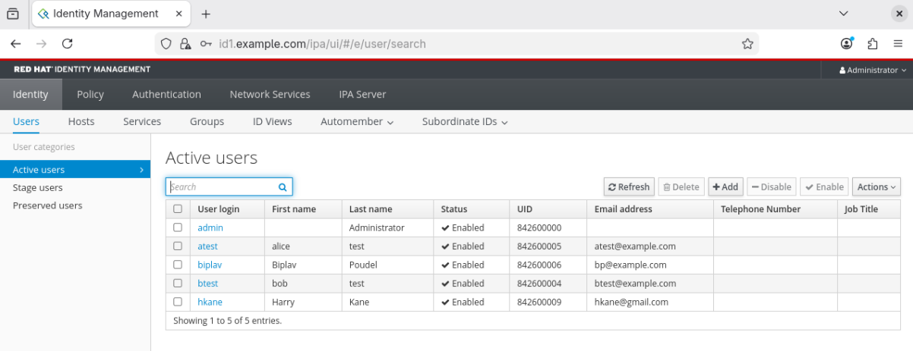
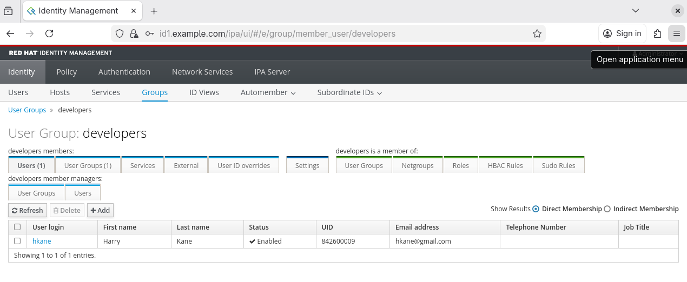
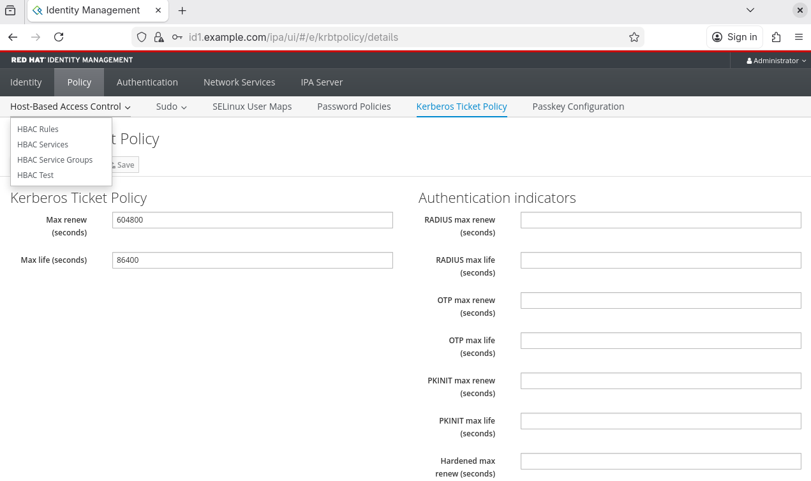

# BUILDING LINUX SERVERS: DHCP, DNS AND DS
Notebook for Building Linux Servers (DHCP, DNS, DS) Course.

## TABLE OF CONTENTS

- [BUILDING LINUX SERVERS: DHCP, DNS AND DS](#building-linux-servers-dhcp-dns-and-ds)
  - [TABLE OF CONTENTS](#table-of-contents)
  - [INTRODUCTION](#introduction)
- [1. BUILDING DHCP SERVER](#1-building-dhcp-server)
  - [1. Setup ISC-Kea reposiory:](#1-setup-isc-kea-reposiory)
  - [2. Setup BuildingLinuxServer repository:](#2-setup-buildinglinuxserver-repository)
  - [3. Configure Kea-DHCP4-Server](#3-configure-kea-dhcp4-server)
  - [4. Update KVM's NAT Network Connection](#4-update-kvms-nat-network-connection)
  - [5. Renew lease on client VMs](#5-renew-lease-on-client-vms)
  - [6. Use Postgressql as Lease Database](#6-use-postgressql-as-lease-database)
  - [7. Benchmarking DHCPv4](#7-benchmarking-dhcpv4)
  - [8. Run Kea-DHCP4 Server as Container](#8-run-kea-dhcp4-server-as-container)
- [2. BUILDING DNS SERVER](#2-building-dns-server)
  - [1. Installation of BIND Packages](#1-installation-of-bind-packages)
  - [2. Testing BIND9 Daemon](#2-testing-bind9-daemon)
  - [3. Configuration of BIND9 daemon](#3-configuration-of-bind9-daemon)
  - [4. Configuration of Forward and Reverse Lookup Zones](#4-configuration-of-forward-and-reverse-lookup-zones)
  - [5. Verifying Zones and Testing DNS Server](#5-verifying-zones-and-testing-dns-server)
- [3. CONFIGURING DYNAMIC DNS SERVER (DDNS)](#3-configuring-dynamic-dns-server-ddns)
  - [1. Installation of DDNS Packages](#1-installation-of-ddns-packages)
  - [2. Update BIND Configuration](#2-update-bind-configuration)
  - [3. Disabling AppArmor for BIND](#3-disabling-apparmor-for-bind)
- [4. BUILDING DIRECTORY SERVER](#4-building-directory-server)
  - [1. Copy DNS Records from DS Server to DNS Server](#1-copy-dns-records-from-ds-server-to-dns-server)
  - [2. Open Firewall Ports in DS Server](#2-open-firewall-ports-in-ds-server)
- [5. ADMINISTRATION OF DIRECTORY SERVICES](#5-administration-of-directory-services)
  - [1. Managing Users](#1-managing-users)
    - [1. Add a User](#1-add-a-user)
    - [2. Find Information on a User](#2-find-information-on-a-user)
    - [3. Edit existing User Record](#3-edit-existing-user-record)
    - [4. Delete a User](#4-delete-a-user)
    - [5. GUI Sample](#5-gui-sample)
  - [2. Managing Groups](#2-managing-groups)
    - [1. Find All Groups](#1-find-all-groups)
    - [2. Add Group](#2-add-group)
    - [3. Add a User to a Group](#3-add-a-user-to-a-group)
    - [4. Remove User from a Group](#4-remove-user-from-a-group)
    - [5. Nesting Groups](#5-nesting-groups)
    - [6. GUI Sample](#6-gui-sample)
  - [3. Managing Hosts](#3-managing-hosts)
    - [1. Find all available Hosts](#1-find-all-available-hosts)
    - [2. Add Hosts](#2-add-hosts)
    - [3. Delete a Host](#3-delete-a-host)
    - [4. Modify a pre-existing Host](#4-modify-a-pre-existing-host)
  - [4. Working with Policies (like Kerberos Ticketing)](#4-working-with-policies-like-kerberos-ticketing)
    - [1. Get Kerberos Ticket Policies](#1-get-kerberos-ticket-policies)
    - [2. Update Ticket Policy](#2-update-ticket-policy)
    - [3. Reset Policies](#3-reset-policies)
    - [4. GUI Sample](#4-gui-sample)
  - [5. Connecting Client to Directory Service:](#5-connecting-client-to-directory-service)
  - [6. Setting up User Accounts on Client:](#6-setting-up-user-accounts-on-client)
- [6. REAL WORLD SCENARIOS](#6-real-world-scenarios)
  - [1. Creation of IPA Sysadmin to replace default IPA Admin](#1-creation-of-ipa-sysadmin-to-replace-default-ipa-admin)
  - [2. Passwordless authentication to remote servers](#2-passwordless-authentication-to-remote-servers)
  - [3. Tilix for tiling terminals](#3-tilix-for-tiling-terminals)
  - [4. Add sysadmin account to IPA](#4-add-sysadmin-account-to-ipa)
  - [5. Tmux for multiple terminal sessions in a single SSH Connection](#5-tmux-for-multiple-terminal-sessions-in-a-single-ssh-connection)
  - [Additional Notes](#additional-notes)


## INTRODUCTION

For this test environment, I am using headless **Debian 13.2.0** (trixie) as the default OS for the DHCP and DNS servers, while the DS Server is using **Red Hat Enterprise Linux 10.0**. The virtualization solution I am using for this lab is **Linux KVM (Kernel-based Virtual Machine)**. The configuration files are based on one of my test labs that runs on the `10.0.2.0/24` NAT network, called `ServersNAT`.

DHCP Server *(hostname: **dhcp1**)* uses `10.0.2.4/24`, DNS Server *(hostname: **ns1**)* uses `10.0.2.5/24` and Directory Server *(hostname: **id1**)* uses `10.0.2.6/24` as the static IP addresses with **example.com** as domain name. 

I have also added two clients, with **Gnome Desktop Enviroment**, within the same ServersNAT virtual-network: **fedora-client** and **debclient**. These clients can, also, be used to interact and access the GUI of **Red Hat Identity Management (IdM)**, which is the software we will use for our Directory Service.

Here is the network topology of my virtualization configuration:


***Figure**: Network Topology for ServersNAT*
<br>

This notebook and all of the included configuration files are designed for learning and testing purposes, and not for use in a production environment.
<br><br>

# 1. BUILDING DHCP SERVER

I have already created a Debian-based VM with FQDN, `dhcp1.example.com` with static IP: `10.0.2.4/32` to act as the DHCP Server for this network, ServersNAT.

*For official documentation on installing kea packages, refer to: https://kb.isc.org/docs/isc-kea-packages .<br>*

## 1. Setup ISC-Kea reposiory:
First setup `kea-3.0` repository in debain as:
```bash
curl -1sLf \
  'https://dl.cloudsmith.io/public/isc/kea-3-0/setup.deb.sh' \
  | sudo -E bash
```
Then install `isc-kea` as:
```
apt install isc-kea
```

## 2. Setup BuildingLinuxServer repository:
Now, make sure you are logged in as **root** to the Debian system.
Access the **~** directory and clone this repository.

```bash
su -
cd ~ && git clone https://github.com/biplavpoudel/BuildingLinuxServer.git
cd BuildingLinuxSever
```

## 3. Configure Kea-DHCP4-Server
For `kea-dhcp4.conf` file, install the **kea-dhcp4** server and then, copy the individual files to their respective locations. Backup the original configurations file first.

```bash
apt install isc-kea-dhcp4-server
systemctl disable isc-kea-dhcp4-server.service

mv /etc/kea/kea-dhcp4.conf /etc/kea/dhcp4.conf.bak
cp /kea/kea-dhcp4.conf /etc/kea/
```

Test the configuration now. Optionally, use **journalctl** for more in-depth system logs.
```bash
kea-dhcp4 -t /etc/kea/kea-dhcp4.conf

journalctl -u isc-kea-dhcp4-server.service
```

Fix any errors and start up the service:
```bash
systemctl enable --now isc-kea-dhcp4-server.service
systemctl status isc-kea-dhcp4-server.service
```
If green color is shown, you are good to go!

Ensure the server is listening on **port 67** for incoming DHCP requests by checking all the open ports:
```bash
ss -tulnw
```

## 4. Update KVM's NAT Network Connection
I am using a manually created NAT network called **ServersNAT**, in my KVM host, for all the VMs.
```bash
sudo virsh net-edit ServersNAT
```

So locate and remove the `<dhcp>` section inside `<ip>` element. Then re-activate the network as:
```bash
sudo virsh net-destroy ServersNAT
sudo virsh net-start ServersNAT
```

## 5. Renew lease on client VMs
Make sure you have `isc-dhcp-client` package installed.
```bash
sudo apt install isc-dhcp-client
```
Then renew the DHCP lease using:
```bash
sudo dhclient -r
sudo dhclient
```

## 6. Use Postgressql as Lease Database
Ensure you build and compile the binary package with switch **-D postgresql=enabled** .
For more info, visit: https://kea.readthedocs.io/en/kea-3.0.2/arm/install.html#building-with-postgresql-support

```bash
git clone https://gitlab.isc.org/isc-projects/kea.git
cd kea
git checkout 3.0.2
meson setup build -D postgres=enabled
meson compile -C build
meson install -C build
```

After setup, update `/etc/kea/kea-dhcp4.conf` as:
```json
"database": {
    "type": "postgresql",
    "host": "192.168.254.26",
    "name": "kea_db",
    "user": "kea_user",
    "password": "****"
}
```

In this example, I have set up PostgreSQL database in my KVM host so I used my host IP `192.168.254.26`.

Visit this link to configure the database: https://kea.readthedocs.io/en/kea-3.0.2/arm/admin.html#pgsql-database-create

In the host, modify `/var/lib/data/pgsql/pg_hba.conf` to include:
```c
host  kea_db  kea_user  10.0.2.4/32 md5
```

Add a firewall rule to allow incoming connection to 5432 port as:
```bash
sudo firewall-cmd --zone=libvirt --add-port=5432/tcp --permanent
```

Then test from dhcp1 as: `psql -h 192.168.254.26 -U kea_user -d kea_db`
Then intialize database as: 
```bash
kea-admin db-init pgsql \
  -h '192.168.254.26' \
  -n 'kea_db' \
  -u 'kea_user' \
  -p '****'
```

*Took me a long time to figure it out!!!*

## 7. Benchmarking DHCPv4
Install **isc-kea** repository in your client VM and then install `perfdhcp` package:
```bash
sudo apt install isc-kea-perfdhcp
```
Ensure the isc-kea version matches between client and server.

Now to benchmark, run `perfdhcp` against the kea-dhcp4 server `10.0.2.4`:
```bash
perfdhcp 10.0.2.4
```

To specify number of **4-way exchanges (DORA)** for second, use:
```bash
perfdhcp -r <number_of_exchanges> 10.0.2.4
```

## 8. Run Kea-DHCP4 Server as Container

Create a network, say `network1`, with:
```bash
podman network create network1
podman network inspect network1
```

Then we will pull the latest ubuntu image, set its network and MAC address and run it as a privileged container:
```bash
podman create -ti --privileged --net=network1 --mac-address 1a:1b:1c:1d:1e:1f  ubuntu
```

You can rename container, in my case it was peaceful_sutherland; then check it and run as:
```bash
podman rename peaceful_sutherland kea-1
podman container ls -a
podman container start kea-1
```

Install necessary packages externally using:
```bash
podman exec kea-1 apt install curl iputils-ping git net-tools vim -y
```

To enter into the container's `/bin/bash`, use:
```bash
podman exec -it kea-1 /bin/bash
```
 
Since systemctl is not running inside the kea-1 container, after installing `isc-kea` packages and configuring `kea-dhcp4.conf` file, you can use:
```bash
podman exec kea-1 /etc/init.d/isc-kea-dhcp4-server status
podman exec kea-1 /etc/init.d/isc-kea-dhcp4-server start
```

Rest of the steps are pretty similar as running kea-dhcp4-server in VM.
<br><br>

# 2. BUILDING DNS SERVER

I have created a Debian-based VM with FQDN, `ns1.example.com` with static IP: `10.0.2.5/32` to act as the DNS Server for this network, ServersNAT.

## 1. Installation of BIND Packages
Install the necessary **bind9 (Berkeley Internet Name Domain)** packages:
```bash
apt install -y bind9 bind9-doc dnsutils
systemctl status bind9.service
```

Installation and configuring process is different for rpm-based distros like RedHat, CentOS and Fedora.
```bash
dnf install bind bind-utils
systemctl status named
systemctl start named

vim /etc/named.conf     # in debian, it is in /etc/bind/named.conf
```

## 2. Testing BIND9 Daemon
To check if **bind9** daemon is repsonding or not, we can query **NS records** for root domain "**.**" using loopback address as DNS Server:
```bash
dig @127.0.0.1 . NS
```

## 3. Configuration of BIND9 daemon
Now, in `/etc/resolv.conf` change the nameserver to point to this VM's IP:
```c
nameserver 10.0.2.5
```

Ensure the `/etc/kea/kea-dhcp4.conf` in dhcp1 (10.0.2.4) correctly points to 10.0.2.5 for DNS in `option-data/domain-name-servers` key.

Since we want to mostly work in IPv4, we will direct named daemon to listen on IPv4 sockets only. 
Modern Debian system uses `/etc/default/named` for service runtime options, so open and modify the file:
```bash
sudo nano /etc/default/named
```
Locate `OPTIONS` line and append `-4`.
```ini
OPTIONS="-u bind -4"
```

Then, we run:
```bash
systemctl restart named
```

To confirm BIND no longer listens on IPv6 sockets:
```bash
ss -tulpn | grep named
```
It should be noted that `named.service` is an alias for `bind9.service`.

## 4. Configuration of Forward and Reverse Lookup Zones

After copying `named.conf.*` into `/etc/bind`, create a new directory `/etc/bind/zones` and copy db.* files there.
```bash
cp BuildingLinuxServer/bind-files/named.conf.* /etc/bind/
cd /etc/bind
mkdir zones && cd zones
cp ~/BuildingLinuxServer/bind-files/db.example.com .
cp ~/BuildingLinuxServer/bind-files/db.2.0.10 .
```

## 5. Verifying Zones and Testing DNS Server
You can check zone files using:
```bash
named-checkconf
```

To check **individual** zone file:
```bash
named-checkzone example.com /etc/bind/zones/db.example.com
named-checkzone 2.0.10.in-addr.arpa /etc/bind/zones/db.2.0.10
```

To check all zones **at once**:
```bash
named-checkconf -z
```
<br><br>

# 3. CONFIGURING DYNAMIC DNS SERVER (DDNS)
The Kea DHCP-DDNS Server (also called **D2**) conducts the client side of the Dynamic DNS protocol, on behalf of the DHCPv4 (kea-dhcp4) and DHCPv6 servers (kea-dhcp6).

The DHCP server constructs DDNS update requests, known as **NameChangeRequests (NCRs)**, based on DHCP lease change events and then post them to D2. D2 then attempts to match each request to the appropriate DNS server and carries out the necessary conversation with those servers to update the DNS data.

## 1. Installation of DDNS Packages
Install **kea-dhcp-ddns** server  as:
``` bash
apt install isc-kea-dhcp-ddns-server
systemctl enable --now isc-kea-dhcp-ddns-server.service
```

Backup the existing files in `/etc/kea` and copy the files from the repo's `/kea-files/ddns-config-files` to the `/etc/kea` directory.

Validate the configurations for both:
```bash
kea-dhcp4 -t /etc/kea/kea-dhcp4.conf
kea-dhcp-ddns -t /etc/kea/kea-dhcp-ddns.conf
```

## 2. Update BIND Configuration
Now let's head over to DNS server, **ns1** (10.0.2.5) and add the line `allow-update { 10.0.2.4; };` in both forward and reverse lookup zones in `/etc/bind/named.conf.local`.

Here is the file:
```c
zone "example.com" 
	{
	type master;
	file "/etc/bind/zones/db.example.com";
	allow-update { 10.0.2.4; }; 
	};

zone "2.0.10.in-addr.arpa"
	{
	type master;
	file "/etc/bind/zones/db.2.0.10";
	allow-update { 10.0.2.4; };
	};

```
This is **unsecure** for production as non-authenticated updates are being sent over to DNS from DHCP, without encryption using **TSIG keys.**

## 3. Disabling AppArmor for BIND
Debian ships with an AppArmor profile for named that prevents BIND from writing to zone files located under `/etc/bind/zones/`.<br>
For Dynamic DNS (DDNS) to work, **BIND** must be allowed to modify its zone files and create **.jnl** journal files.<br>

For simplicity, we will disable the Apparmor profile for bind daemon.

First, let's list **AppArmor** profile belonging to bind daemon:
```bash
ls /etc/apparmor.d | grep named
# >> usr.sbin.named
```

Then diable the AppArmor profile with:
```bash
ln -s /etc/apparmor.d/usr.sbin.named /etc/apparmor.d/disable/
apparmor_parser -R /etc/apparmor.d/usr.sbin.named 
```

Restart the **AppArmor** and **BIND**:
```bash
systemctl restart apparmor
systemctl restart named
```
<br><br>

# 4. BUILDING DIRECTORY SERVER
I have decided to use a RedHat VM as DS Server (10.0.2.6) with fqdn: `id1.example.com`.<br>
To build a Directory Service, we need to install `RedHat Identity Management (IdM)` as our centralized IAM software solution.<br>
```bash
dnf install ipa-server
```
**NOTE:** Since all IdM server packages are now available in **standard AppStream repository**, we no longer need to enable it with: *`dnf module enable idm:DL1 && dnf distro-sync`* command.

Now to configure **IPA** (Identity, Policy and Audit), we run:
```bash
ipa-server-install
```
Here we setup FQDN, Hostname, Kerberos Realm, Directory Manager, IPA Admin, self-signed CAs and many more.

## 1. Copy DNS Records from DS Server to DNS Server
We need to copy the generated DNS records inside `/tmp/ipa.system.records.0v1xmmd3.db/` to the `ns1.example.com` DNS server.<br>
So, from `id1.example.com` VM, we run:
```bash
rsync /tmp/ipa.system.records.0v1xmmd3.db user@10.0.2.5:/home/user
```

Then inside the `ns1.example.com` VM, we append the records to `/etc/bind/zones/db.example.com` using **>>** (append redirection operator):
```bash
cat /home/user/ipa.system.records.0v1xmmd3.db >> /etc/bind/zones/db.example.com
printf "\n" >> /etc/bind/zones/db.example.com
```

To check and validate our zones, run: 
```bash
named-checkzone example.com /etc/bind/zones/db.example.com
```

And restart the **bind9** service:
```bash
systemctl restart named
```

## 2. Open Firewall Ports in DS Server
We need to open these TCP and UDP ports in the **firewalld** daemon:<br>
**TCP Ports:**
```
80, 443: HTTP/HTTPS
389, 636: LDAP/LDAPS
88, 464: kerberos 
```

**UDP Ports:**
```
88, 464: kerberos
123: ntp 
```

The commands to add the above TCP/UDP ports permanently are:
```bash
firewall-cmd --add-port=80/tcp --add-port=443/tcp --add-port=389/tcp --add-port=636/tcp --add-port=88/tcp --add-port=464/tcp --permanent
firewall-cmd --add-port=88/udp --add-port=464/udp --add-port=123/udp --permanent
firewall-cmd --reload
firewall-cmd --list-ports 
```

Also backup the CA certificates stored as `cacert.p12`, inside root:
```bash
mkdir ~/backup
cp cacert.p12 ~/backup/
```
<br><br>

# 5. ADMINISTRATION OF DIRECTORY SERVICES
To use IPA (Identity, Policy and Audit) tools, we need a Kerberos Ticket, which we can get using:
```bash
kinit admin
```
## 1. Managing Users

### 1. Add a User
To add user with password and bash login shell:
```bash
ipa user-add hk --first Harry --last Kane --manager biplav --email=harry@gmail.com --homedir=/home/hkane --password --shell=/bin/bash
```

The resulting prompt and output is displayed as:
```
Password: 
Enter Password again to verify: 
---------------
Added user "hk"
---------------
  User login: hk
  First name: Harry
  Last name: Kane
  Full name: Harry Kane
  Display name: Harry Kane
  Initials: HK
  Home directory: /home/hkane
  GECOS: Harry Kane
  Login shell: /bin/bash
  Principal name: hk@EXAMPLE.COM
  Principal alias: hk@EXAMPLE.COM
  User password expiration: 20251208142811Z
  Email address: harry@gmail.com
  UID: 842600008
  GID: 842600008
  Manager: biplav
  Password: True
  Member of groups: ipausers
  Kerberos keys available: True
```
### 2. Find Information on a User
To find information on a user, we can use:
```bash
ipa user-find bip
``` 
The resulting output as:
```
--------------
1 user matched
--------------
  User login: biplav
  First name: Biplav
  Last name: Poudel
  Home directory: /home/biplav
  Login shell: /bin/bash/
  Principal name: biplav@EXAMPLE.COM
  Principal alias: biplav@EXAMPLE.COM, bp@EXAMPLE.COM
  Email address: bp@example.com
  UID: 842600006
  GID: 842600006
  Account disabled: False
----------------------------
Number of entries returned 1
----------------------------
```

For information on all users:
```
ipa user-find --all
```
### 3. Edit existing User Record 
To edit user information, we can use:
```bash
ipa user-mod <user_login> [--addattr/--rename/--set-attr/...]=<new_value>

ipa user-mod hk --rename=hkane
ipa user-mod hkane --email=hkane@gmail.com
```

### 4. Delete a User
To delete a specific user, we run:
```bash
ipa user-del hkane
```

### 5. GUI Sample
We can use GUI to manage users by entering url for the id1 server in any browser, which in my case, is: `https://10.0.2.6`, that resolves to `id1.example.com`, and logging in as IPA Admin. <br><br>



## 2. Managing Groups

### 1. Find All Groups 
To find all groups in the IdM Directory, we run:
```bash
ipa group-find --all
```

### 2. Add Group
Similar to adding users, we can add groups like:
```bash
ipa grobashup-add Developers --desc="Programmers"
```

Output as:
```
------------------------
Added group "developers"
------------------------
  Group name: developers
  Description: Programmers
  GID: 842600010
```
### 3. Add a User to a Group 
To add a user to a group, we use:
```bash
ipa group-add-member Developers --users=hkane
```

Output as:
```
Group name: developers
Description: Programmers
GID: 842600010
Member users: hkane
-------------------------
Number of members added 1
-------------------------
```
### 4. Remove User from a Group 
To remove specific user, we run: 
```bash
ipa group-remove-member Developer --users=hkane
```

### 5. Nesting Groups
To add an existing member group to a group, we run:
```bash
ipa group-add-member Developers --groups=Engineers
```

Output:
```
  Group name: developers
  Description: Programmers
  GID: 842600010
  Member users: hkane
  Member groups: engineers
-------------------------
Number of members added 1
-------------------------
```

### 6. GUI Sample
Inside the **User Groups/developers** in GUI, we can see:<br><br>


## 3. Managing Hosts
In this lab, we are particularly concerned with managing servers, not client VMs.

### 1. Find all available Hosts
To find available systems associated with ipa, we run:
```
ipa host-find --all
```
### 2. Add Hosts 
We can add hosts using FQDN if the host has corresponding DNS A/AAAA record in the network's DNS Server, which in our case is `ns1.example.com`.
```bash
ipa host-add dhcp1.example.com
ipa host-add ns1.example.com
```
### 3. Delete a Host 
To delete a specific host, just run (for example):
```bash
ipa host-del ns1.example.com
```

### 4. Modify a pre-existing Host 
To modify an exisiting host,
```bash
ipa host-mod dhcp1.example.com --desc="DHCPv4 server" --os=Debian-13
```

Output:
```
  ---------------------------------
  Modified host "dhcp1.example.com"
  ---------------------------------
    Host name: dhcp1.example.com
    Description: DHCPv4 server
    Operating system: Debian-13
    Principal name: host/dhcp1.example.com@EXAMPLE.COM
    Principal alias: host/dhcp1.example.com@EXAMPLE.COM
    Password: False
    Keytab: False
    Managed by: dhcp1.example.com
```

## 4. Working with Policies (like Kerberos Ticketing)
### 1. Get Kerberos Ticket Policies
To see kerberos ticket policy for users and admin, we can run:
```
ipa krbtpolicy-show
ipa krbtpolicy-show admin
``` 

### 2. Update Ticket Policy 
Before: (Same for admin and non-admin users)
```
Max life: 86400
Max renew: 604800
```

Now let's modify max life from 24 hours to 1 hour for admin:
```
ipa krbtpolicy-mod admin --maxlife=3600
ipa krbtpolicy-show admin
```
Now, the output for admin is:
```
Max life: 3600
Max renew: 604800
```

### 3. Reset Policies
To reset to default values, we run:
```
ipa krbtpolicy-reset admin
```
### 4. GUI Sample
We can also use GUI to access and modify policies for users:<br><br> 


## 5. Connecting Client to Directory Service:
In Fedora-based client VM, inside the same network as **ns1**, **dhcp1** and **id1** servers, we need to install `freeipa-client` package instead of RedHat's `ipa-server`:
```bash
dnf install freeipa-client
```

Now to setup the IPA client, with home directory for users assigned from IdM, we run:
```bash
ipa-client-install --mkhomedir
```

## 6. Setting up User Accounts on Client:
1. If you are using Gnome Desktop Environment in Fedora Client, you can head over to : **Settings > System > Users** and unlock the settings.<br>
2. Choose **Enterprise Login** and add Domain (example.com), Username and Password for users from Directory Server. <br>
3. If you are unsure, you can find all added users by running `ipa user-find --all` in the bash shell of directory service, `id1.example.com`. <br>
4. After the user account setup, logout from current user and login as the new user.

<br><br>

# 6. REAL WORLD SCENARIOS
## 1. Creation of IPA Sysadmin to replace default IPA Admin
It's better to use a different admin account with all the administrative rights, like **sysadmin**, for IPA administration and servers management, instead of a default keroberos *admin* and/or *root* account. Also it is more secure to use SSH keys instead of passwords for connecting to all servers.

So, lets ssh into `dhcp1.example.com` and add `sysadmin` to sudoers group:
```bash
adduser sysadmin
usermod -aG sudo sysadmin         # debian,ubuntu
usermod -aG wheel sysadmin        # redhat,fedora,centos
```
Repeat this step with all the hosts.
## 2. Passwordless authentication to remote servers
Now, we create a ssh keypair and use the .pub key to authenticate with all servers.
```bash
ssh key-gen
ssh-copy-id sysadmin@10.0.2.4
ssh-copy-id sysadmin@10.0.2.5
ssh-copy-id sysadmin@10.0.2.6
```
**ssh-copy-id** is a SSH wrapper that copy/paste the generated ssh public key to `~/.ssh/authorized_keys` for each server.

## 3. Tilix for tiling terminals
We can use tilix for managing multiple terminal sessions under a single window.
Install in a Debian-based client using:
```bash
apt install tilix
```
You can create horizontal split with: `Ctrl+Alt+R` and vertical split with: `Ctrl+Alt+D`
and move between them using: `Alt+Arrows`

## 4. Add sysadmin account to IPA
Inside `id1.example.com` DS Server, run:
```bash
kinit admin
ipa user-add sysadmin
ipa group-add-member admins --user=sysadmin
```
## 5. Tmux for multiple terminal sessions in a single SSH Connection
Tmux can be be used to manage persistent, multi-terminal sessions within a single SSH Connection. It can be installed with:
```bash
apt install tmux -y
```
Run `tmux` within a ssh session and use ***`Ctrl+B` + <specific commands*>** to split, navigate and switch panes/windows.

Follow the guide: https://www.redhat.com/en/blog/introduction-tmux-linux for some tips.
<br><br>

## Additional Notes
1. For this test environment I am using Debian 13 (trixie) as a server for DHCP and DNS (with no GUI) with NAT for inter-VM communication.
2. I have used separate Debian VMs for DHCP and DNS using KVM.
3. The configuration files are based on one of my test labs that runs on the `10.0.2.0/24` NAT network.
4. DHCP Server uses `10.0.2.4/32` and DNS Server uses `10.0.2.5/32`
5. To use dhcp relay, you can use either `OPNSense`, `pfSense` or similar tools. Just attach both networks to the VM and set static IPs 10.0.2.220 and 192.168.122.x/32 for both networks respectively. Look into `kea-files/kea-dhcp4.conf.dhcprelay` for IP configurations. You still need to configure firewalls in the OPNSense VM.
6. Sometimes, the client VMs aren't leased IPv6 addresses from kea-dhcp6 server. The existing IPv6 addresses are either link-local only or from SLAAC addresses (temporary and stable/EUI-64) assigned by router. To remedy that, run `sudo dhclient -6 -v <interface-name>`. *Very confusing!!*